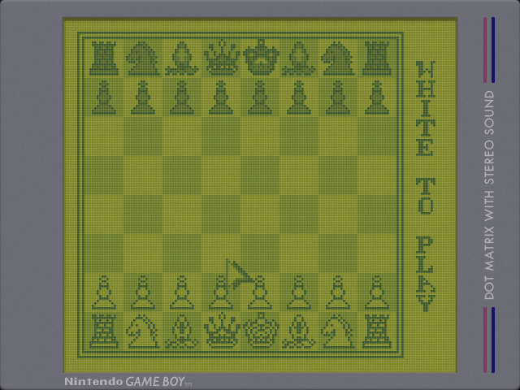
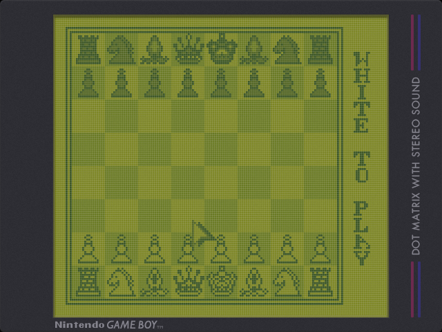

# Miyoo Mini +
## Overlays
### DMG
#### Inspirat

  
Drew inspiration from **drkhrse**'s bezel and rebuilt it from scratch to join the MM+ customization fun.  

---
### Onyx

  
A ~60% darker variant with rebalanced colors for late-night DMG sessions.  

---
### Mario's Picross (UE)
.png)
  
A tribute to one of my most-played DMG games — inspired by the **Picross 2** overlay for the Super Game Boy.
  
## Palettes
### DMG
#### Inspirat

---
#### Mario's Picross (UE)
.png)

---
#### ℹ️ NOTES
- All .PNG files were optimized with [OptiPNG](https://optipng.sourceforge.net/).  
- The **DOT MATRIX WITH STEREO SOUND** text label uses the **Futura** font.  
- The **Nintendo** text label uses the **Pretendo** font.  
- The **GAME BOY** text label uses the **Gill Sans** font.  