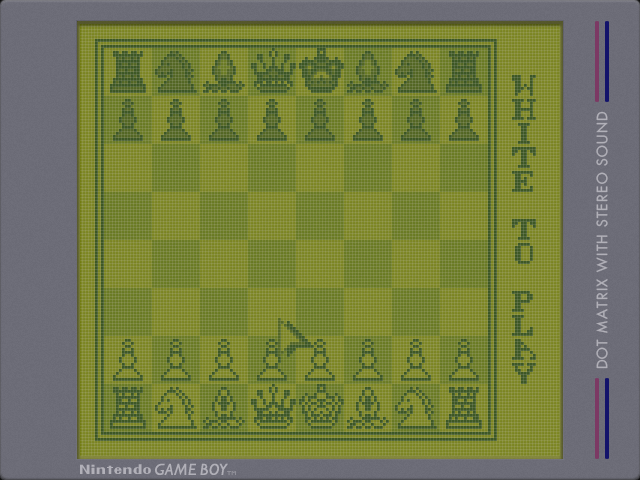
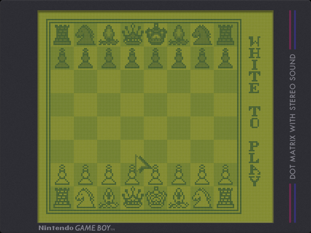

# MMP
A unified repository for all things **MIYOO Mini+** (MY354)  

## Contents
### Firmware
Mirrors for official MIYOO-provided firmware binaries, copied over from **annz1**.  

| Build | Build Date | Full Name |
| --- | --- | --- |
| **0312** | 2023/03/12 | `202303121739` |
| **0326** | 2023/03/26 | `202303262339` |
| **0329** | 2023/03/29 | `202303292051` |
| **0505** | 2023/05/05 | `202305052130` |
| **0609** | 2023/06/09 | `202306092122` |
| **0628** | 2023/06/28 | `202306282128` |

---
### Overlays
Custom overlay CFG files and respective PNGs.  

### DMG
### _Inspirat_
Inspired by **drkhrse**'s bezel; remade from scratch with source-available PSD file.  
  

  
---
### _Onyx_
A ~60% darker variant with rebalanced colors for late-night DMG sessions.  
  

  
---
### Game-Specific
### _Mario's Picross_
A tribute to one of my most-played DMG games; inspired by the **Picross 2** overlay for the **Super Game Boy**.
  

  
---
  
### Palettes
### DMG
### _Inspirat_

### _Mario's Picross_

---
### 🗒️ NOTES
Fonts used in the text labels of the overlays, for anyone interested in making their own overlays with a similar aesthetic.  

| Text Label | Font |
| --- | --- |
| **DOT MATRIX WITH STEREO SOUND** | _Futura_ |
| **Nintendo** | _Pretendo_ |
| **GAME BOY** | _Gill Sans_ |

All PNG files were optimized with [OptiPNG](https://optipng.sourceforge.net/).  